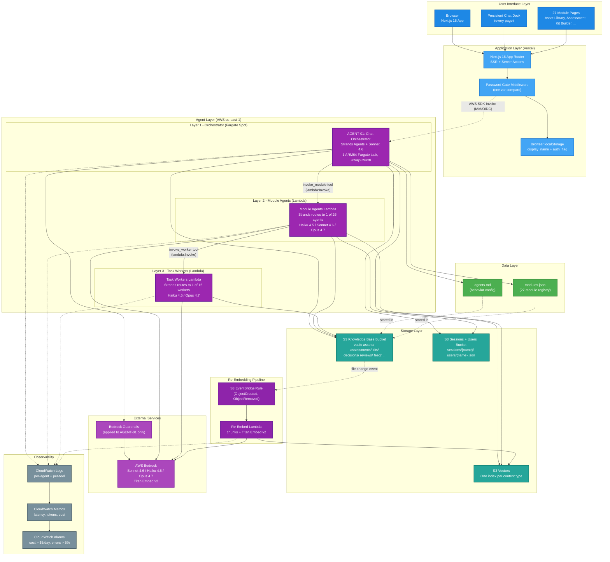
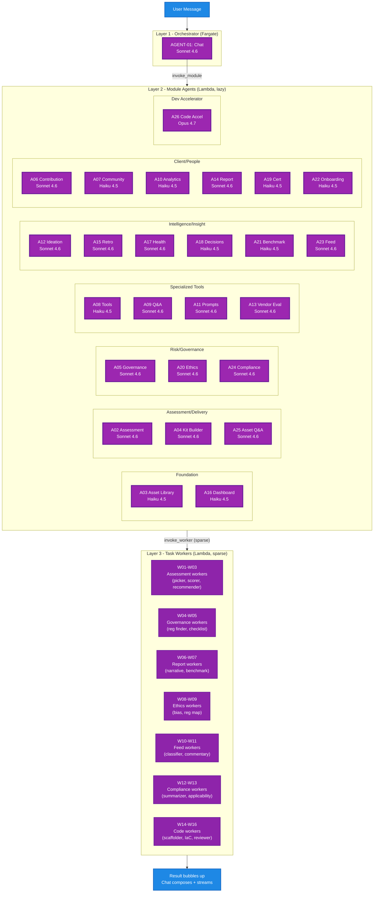

# System Design: AI CoE Platform

> Generated: 2026-06-03
> Source brief: ai_docs/brief.md
> Source template: docs/templates/02a_generate_system_design.md
> Status: Locked

---

## 1. Design Summary

- **Project:** AI CoE Platform
- **One-line pitch:** Internal platform for consultants at AI-focused IT consulting firms, hierarchical multi-agent system over a markdown knowledge base, covering all 27 modules from the north-star vision.
- **Architecture pattern:** Hybrid agent pipeline + serverless event-driven. Fargate-hosted orchestrator (warm, low-latency), Lambda-hosted module agents and task workers (cold-startable, cheap), S3-backed content substrate, S3 Vectors for retrieval.
- **Stack:** Foundation: AWS Bedrock + Strands Agents + S3 + S3 Vectors. Extensions: Next.js 16 frontend on Vercel, AWS Lambda + Fargate for compute, CDK Python for IaC.
- **Solo or team:** solo

---

## 2. Architectural Decisions

### AD-01: Agent runtime topology

- **Context:** 1 orchestrator (AGENT-01) + 26 module agents + 16 task workers = 43 distinct agent identities (brief Section 6). Cold-start on the user-facing orchestrator would blow NFR-001 (first-token p95 < 3s). Demo traffic is too low to keep Lambdas warm naturally.
- **Chose:** Hybrid. Fargate for the orchestrator (warm, sub-second invoke), one Lambda for all 26 module agents (internal Strands routing), one Lambda for all 16 task workers (internal Strands routing).
- **Reason:** Orchestrator latency matters because the user is waiting for first token. Module agents and workers run inside an already-streaming response, so cold start is invisible to the user. Single Lambda per layer keeps the deploy artifact count to 2, not 42.
- **Trade-off accepted:** Fargate adds ~$5-8/month (1 ARM64 Fargate Spot task with minimal CPU/memory). Module agents share runtime memory, so a poison message in one agent could crash adjacent invocations. Mitigated by per-invocation isolation in Strands.
- **Revisit when:** monthly Fargate cost exceeds $15, OR module agent Lambda cold start (when invoked) exceeds 2s, OR a single module agent needs different IAM scope than others.

### AD-02: API surface between Next.js and agent runtime

- **Context:** Next.js server actions need to invoke Strands agents. Strands is Python, Next.js is Node. Options were direct Lambda invoke (AWS SDK from server action), API Gateway + Lambda, or FastAPI service in front of Strands.
- **Chose:** Next.js server actions invoke Lambda directly via AWS SDK (lambda:Invoke).
- **Reason:** Saves API Gateway cost and one network hop (~50-100ms). FastAPI adds a moving part with no value at demo scale. Vercel server actions support direct AWS SDK calls with IAM credentials via OIDC federation.
- **Trade-off accepted:** No HTTP-layer caching, no WAF, no Lambda function URL public surface. All access goes through Vercel server actions (server-side, behind app password gate). Cannot easily expose agent endpoints to mobile apps or third parties post-demo. Captured as a post-demo concern.
- **Revisit when:** mobile app needed, OR public API surface needed, OR WAF/rate-limit becomes a real requirement (multi-tenant).

### AD-03: Module registry format

- **Context:** Chat orchestrator needs metadata for 27 modules (purpose, when-to-use, example queries, model tier, agent ID). Brief Q-02 left this open.
- **Chose:** Single `vault/modules.json` file. Structured fields, validated against a Pydantic schema on load.
- **Reason:** The registry is structured data, not narrative. One JSON file is atomic to edit, easy to validate, cheap to load (loaded once per Fargate task lifetime, cached in memory). The `agents.md` file at vault root remains for free-form behavior tuning. Two files, two purposes.
- **Trade-off accepted:** Adding a module means editing modules.json + creating the agent module + updating CDK. JSON edits are error-prone if done by hand, mitigated by schema validation on Fargate startup (fails fast).
- **Revisit when:** the registry grows past ~50 entries, OR non-developer curators need to edit it.

### AD-04: Session state architecture

- **Context:** Chat conversation history, user activity, kits, assessments all need durable storage. Brief targeted demo traffic (1-2 users, 50-100 turns/day).
- **Chose:** Pure S3 JSON for sessions, users, kits, assessments. No DynamoDB, no Postgres.
- **Reason:** S3 read latency (~50-100ms) is invisible inside a 3s first-token budget. DynamoDB would add CDK complexity, schema design, dual-write logic for content cross-references, and ~$0-2/month for negligible benefit. Migration to DynamoDB is a known 2-day project when real users arrive.
- **Trade-off accepted:** No range queries (e.g. "all assessments from last 7 days"). No transactional writes across multiple entities. Pagination must be implemented manually. All acceptable for demo.
- **Revisit when:** any single user accumulates >1000 sessions, OR analytics queries (Module 10) take >5s, OR multi-user concurrent writes appear.

---

## 3. System Architecture Diagram

---

## 4. Component Inventory

- **Browser (Next.js client)**
  - Type: next-app (client)
  - Responsibilities: render module pages, persistent chat dock, asset rendering, kit preview
  - Owns: FR-002, FR-003, FR-010 to FR-015, FR-018, FR-022 to FR-024, all UI-bound FRs
  - Depends on: Next.js server actions
  - Deployment target: Vercel (CDN)
  - Notes: localStorage holds display_name + auth_flag

- **Next.js Server Actions Layer**
  - Type: next-app (server)
  - Responsibilities: password gate, IAM-signed AWS calls (lambda:Invoke, s3:GetObject for static reads), session management, request shaping for the orchestrator
  - Owns: FR-001, request routing for all module FRs
  - Depends on: Chat Orchestrator (Fargate), S3 Sessions + Users Bucket, S3 Vault Bucket (for read-only renders)
  - Deployment target: Vercel
  - Notes: Vercel-AWS IAM federation via OIDC, no long-lived AWS credentials in Vercel env

- **AGENT-01: Chat Orchestrator**
  - Type: strands-agent (Fargate)
  - Responsibilities: route user intent, invoke module agents, compose responses, narrate, cite, stream tokens
  - Owns: FR-003, FR-006 to FR-009, FR-031, and acts as entry point for FR-016, FR-020, FR-023, FR-066, FR-074
  - Depends on: ModuleAgentsLambda, S3 Vault Bucket, S3 Sessions Bucket, S3 Vectors, Bedrock (Sonnet 4.6 + Guardrails)
  - Deployment target: Fargate Spot (1 ARM64 task, 0.25 vCPU / 0.5GB RAM)
  - Notes: warm-always, reads modules.json + agents.md on startup and caches with 60s TTL

- **ModuleAgentsLambda (26 agents inside)**
  - Type: lambda-job (Python, Strands)
  - Responsibilities: AGENT-02 to AGENT-26 implementations
  - Owns: all module-specific FRs (FR-016 to FR-077 minus the orchestrator and UI parts)
  - Depends on: WorkerLambda (for 7 modules), S3 Vault Bucket, S3 Vectors, Bedrock (Haiku 4.5 / Sonnet 4.6 / Opus 4.7 per agent)
  - Deployment target: Lambda (Python 3.12, ARM64, 1024MB, 5min timeout)
  - Notes: Strands routes by agent_id; provisioned concurrency = 0 (cold start acceptable; orchestrator streams while module agent boots)

- **WorkersLambda (16 workers inside)**
  - Type: lambda-job (Python, Strands)
  - Responsibilities: WORKER-01 to WORKER-16 implementations
  - Owns: decomposition tasks for Modules 1, 4, 14, 21, 24, 25, 27
  - Depends on: S3 Vault Bucket, Bedrock (Haiku 4.5 / Opus 4.7)
  - Deployment target: Lambda (Python 3.12, ARM64, 1024MB / 3072MB for code workers, 5min timeout)
  - Notes: only called by ModuleAgentsLambda; 7 of 27 module agents use workers

- **Re-Embed Lambda**
  - Type: lambda-job
  - Responsibilities: on S3 object create/remove, chunk markdown, embed via Titan Embed v2, upsert to S3 Vectors
  - Owns: FR-004
  - Depends on: S3 Vault Bucket, S3 Vectors, Bedrock (Titan Embed v2), EventBridge
  - Deployment target: Lambda (Python 3.12, ARM64, 1024MB, 5min timeout)
  - Notes: hash-based dedup, idempotent on retry

- **S3 Knowledge Base Bucket**
  - Type: s3-bucket
  - Responsibilities: primary content store; vault/ assets/ assessments/ kits/ decisions/ reviews/ feed/ pending/ retros/ engagements/ prompts/ regs/ tools/ vendors/ ...
  - Owns: all content state
  - Depends on: none
  - Deployment target: S3 (Standard, us-east-1, versioning enabled)
  - Notes: object lifecycle policy: noncurrent versions expire after 90 days

- **S3 Sessions + Users Bucket**
  - Type: s3-bucket
  - Responsibilities: chat session JSON files, user profile JSON files
  - Owns: session state
  - Depends on: none
  - Deployment target: S3 (Standard, us-east-1)
  - Notes: separate bucket from vault to keep content vs state cleanly separated

- **S3 Vectors Index**
  - Type: managed-service
  - Responsibilities: vector storage + similarity search per content type
  - Owns: retrieval state for FR-006, FR-041, all RAG-dependent FRs
  - Depends on: none
  - Deployment target: S3 Vectors (managed)
  - Notes: one logical index per content type (assets, decisions, regs, feed, prompts, qa); Titan Embed v2 (1024 dims)

- **AWS Bedrock**
  - Type: external-service (AWS-native)
  - Responsibilities: all LLM inference + embeddings
  - Owns: all LLM dependencies
  - Depends on: none
  - Deployment target: managed
  - Notes: us-east-1; Sonnet 4.6 + Haiku 4.5 + Opus 4.7 + Titan Embed v2

- **Bedrock Guardrails**
  - Type: managed-service
  - Responsibilities: PII detection + prompt attack detection on AGENT-01 only (demo scope)
  - Owns: guardrail FRs (partial coverage by design)
  - Depends on: Bedrock
  - Deployment target: managed
  - Notes: full coverage moved to post-demo-plan.md

- **CloudWatch (Logs + Metrics + Alarms)**
  - Type: managed-service
  - Responsibilities: log aggregation, metric emission, cost + error alarms
  - Owns: observability for all components
  - Depends on: all compute components
  - Deployment target: managed
  - Notes: 30-day retention

---

## 5. Multi-Agent Design

### 5.1 Agent Topology

### 5.2 Per-Agent Sketch (one block per agent ID)

#### AGENT-01: Chat Orchestrator

- **Role:** Front-door conversational agent. Routes intent to module agents. Composes responses. Narrates and cites.
- **Coordination pattern:** orchestrator parent (Layer 1)
- **Model family target:** Sonnet 4.6 (per AD-01 reasoning quality requirement for routing)
- **Tools (high-level):** search_knowledge_base, describe_module, list_modules, invoke_module, read_agents_md
- **Inputs from:** Next.js server action (user message)
- **Outputs to:** Next.js server action (streamed response + citations + ui_actions)
- **State writes:** session JSON to S3 Sessions Bucket after every turn

#### AGENT-02: AI Maturity Assessment

- **Role:** Adaptive 10-question assessment of a client's AI stage; outputs stage 0-5 + recommendations
- **Coordination pattern:** Layer 2 module, called by AGENT-01
- **Model family target:** Sonnet 4.6 (adaptive question flow needs reasoning)
- **Tools (high-level):** invoke_worker (question_picker, scorer, recommender), read_vault, write_assessment_file
- **Inputs from:** AGENT-01 via invoke_module
- **Outputs to:** AGENT-01 (final stage + recommendations); writes assessment .md to vault
- **State writes:** vault/assessments/{display_name}/{timestamp}.md

#### AGENT-03: Asset Library

- **Role:** Filter and retrieve assets from vault; return structured results
- **Coordination pattern:** Layer 2, called by AGENT-01 or directly by Next.js for page rendering
- **Model family target:** Haiku 4.5 (mostly mechanical filtering)
- **Tools:** list_assets, get_asset, search_vector_index
- **Inputs from:** AGENT-01 or Next.js
- **Outputs to:** caller
- **State writes:** none

#### AGENT-04: Engagement Kit Builder

- **Role:** Assemble a kit of vault files + write a one-page README; return zip manifest
- **Coordination pattern:** Layer 2
- **Model family target:** Sonnet 4.6 (composition + narrative)
- **Tools:** search_vault, get_asset, write_kit_files, zip_kit
- **Inputs from:** AGENT-01
- **Outputs to:** AGENT-01 (download URL); writes vault/kits/{display_name}/{timestamp}/
- **State writes:** kit folder in vault

#### AGENT-05: Governance & Risk Checker

- **Role:** Map engagement context to applicable risks and regulations
- **Coordination pattern:** Layer 2
- **Model family target:** Sonnet 4.6
- **Tools:** invoke_worker (regulation_finder, checklist_generator), read_vault
- **Inputs from:** AGENT-01
- **Outputs to:** AGENT-01; writes vault/reviews/governance/
- **State writes:** governance review .md

#### AGENT-06: Knowledge Contribution

- **Role:** Anonymize, tag, dedupe submitted content
- **Coordination pattern:** Layer 2
- **Model family target:** Sonnet 4.6 (anonymization needs care)
- **Tools:** read_vault, write_pending_asset, run_anonymization, suggest_tags
- **Inputs from:** AGENT-01 (when user submits via chat) or Next.js (form submission)
- **Outputs to:** caller; writes vault/pending/
- **State writes:** pending asset .md

#### AGENT-07: Community & Enablement Hub

- **Role:** Surface threads, summarize discussions, recommend learning paths
- **Coordination pattern:** Layer 2
- **Model family target:** Haiku 4.5
- **Tools:** list_threads, summarize_thread, recommend_learning_path
- **Inputs from:** Next.js or AGENT-01
- **Outputs to:** caller
- **State writes:** thread posts to vault/community/

#### AGENT-08: Skills & Tools Repository

- **Role:** Recommend tools by engagement context
- **Coordination pattern:** Layer 2
- **Model family target:** Haiku 4.5
- **Tools:** list_tools, search_vector_index, get_tool
- **Inputs from:** AGENT-01 or Next.js
- **Outputs to:** caller
- **State writes:** none (read-mostly)

#### AGENT-09: Q&A

- **Role:** Synthesize answers from across the Knowledge Base; produce citations
- **Coordination pattern:** Layer 2
- **Model family target:** Sonnet 4.6
- **Tools:** search_vault, search_vector_index, get_thread
- **Inputs from:** AGENT-01 or Next.js
- **Outputs to:** caller; can write AI-drafted answers to vault/qa/pending/ for community review
- **State writes:** Q&A drafts (optional)

#### AGENT-10: Analytics Dashboard

- **Role:** Summarize usage data, generate exportable summaries
- **Coordination pattern:** Layer 2
- **Model family target:** Haiku 4.5
- **Tools:** read_usage_logs (CloudWatch via API), summarize_metrics
- **Inputs from:** Next.js (dashboard render)
- **Outputs to:** caller
- **State writes:** none

#### AGENT-11: Prompt Engineering Studio

- **Role:** Suggest prompt improvements, detect anti-patterns, score versions
- **Coordination pattern:** Layer 2
- **Model family target:** Sonnet 4.6
- **Tools:** test_prompt_against_model, suggest_improvements, detect_antipatterns
- **Inputs from:** Next.js (studio UI)
- **Outputs to:** caller; writes prompt versions to vault/prompts/
- **State writes:** prompt files + version history

#### AGENT-12: Use Case Ideation

- **Role:** Generate ranked use case candidates from client context
- **Coordination pattern:** Layer 2
- **Model family target:** Sonnet 4.6
- **Tools:** read_vault, score_use_cases
- **Inputs from:** AGENT-01 or Next.js
- **Outputs to:** caller; ideation .md to vault/ideation/
- **State writes:** ideation results

#### AGENT-13: Vendor & Model Evaluation Center

- **Role:** Build comparisons, flag stale entries, generate side-by-sides
- **Coordination pattern:** Layer 2
- **Model family target:** Sonnet 4.6
- **Tools:** list_evaluations, get_evaluation, build_comparison
- **Inputs from:** AGENT-01 or Next.js
- **Outputs to:** caller; comparison .md to vault/vendors/comparisons/
- **State writes:** comparison files

#### AGENT-14: Client-Facing Maturity Report Portal

- **Role:** Generate report narrative sections, produce PDF-ready output
- **Coordination pattern:** Layer 2
- **Model family target:** Sonnet 4.6 (high quality narrative)
- **Tools:** invoke_worker (narrative_writer, benchmark_lookup, recommendation_summary), get_assessment, render_pdf
- **Inputs from:** AGENT-01 or Next.js (after assessment complete)
- **Outputs to:** caller; report .md + .pdf to vault/reports/
- **State writes:** report files

#### AGENT-15: Engagement Retrospective Tracker

- **Role:** Extract reusable insights from retrospective free-text
- **Coordination pattern:** Layer 2
- **Model family target:** Sonnet 4.6
- **Tools:** read_engagement_state, extract_insights, write_insight
- **Inputs from:** Next.js (retro form) or AGENT-01
- **Outputs to:** caller; insight .md to vault/retros/insights/
- **State writes:** retro + insights

#### AGENT-16: Personal Dashboard

- **Role:** Generate personalized recommendations based on activity
- **Coordination pattern:** Layer 2
- **Model family target:** Haiku 4.5
- **Tools:** read_user_profile, search_vector_index, list_recent_activity
- **Inputs from:** Next.js
- **Outputs to:** caller
- **State writes:** updates user profile JSON

#### AGENT-17: AI Project Health Monitor

- **Role:** Detect risks from engagement updates, flag deviations from best practices
- **Coordination pattern:** Layer 2
- **Model family target:** Sonnet 4.6
- **Tools:** read_engagement_state, compare_to_reference_architectures, flag_risks
- **Inputs from:** Next.js (update post) or AGENT-01
- **Outputs to:** caller; flags + remediation to vault/engagements/{id}/health.md
- **State writes:** health log per engagement

#### AGENT-18: Decision Log

- **Role:** Tag decisions, find similar past decisions
- **Coordination pattern:** Layer 2
- **Model family target:** Haiku 4.5
- **Tools:** write_decision, search_vector_index, get_similar_decisions
- **Inputs from:** Next.js (decision form) or AGENT-01
- **Outputs to:** caller; decision .md to vault/decisions/
- **State writes:** decision entries

#### AGENT-19: Certification & Badging

- **Role:** Recommend next certification, assess practical exercises
- **Coordination pattern:** Layer 2
- **Model family target:** Haiku 4.5
- **Tools:** read_user_profile, list_certifications, evaluate_submission
- **Inputs from:** Next.js
- **Outputs to:** caller; badge entries to user profile
- **State writes:** user profile updates

#### AGENT-20: AI Ethics & Bias Checker

- **Role:** Identify bias / fairness / explainability risks from use case description
- **Coordination pattern:** Layer 2
- **Model family target:** Sonnet 4.6
- **Tools:** invoke_worker (bias_analyzer, regulation_mapper, ethics_summary_writer), read_vault
- **Inputs from:** AGENT-01 or Next.js
- **Outputs to:** caller; review .md to vault/reviews/ethics/
- **State writes:** ethics reviews

#### AGENT-21: Client Benchmark Comparator

- **Role:** Generate benchmark narratives from peer distribution data
- **Coordination pattern:** Layer 2
- **Model family target:** Haiku 4.5
- **Tools:** read_benchmark_data, write_benchmark_narrative
- **Inputs from:** AGENT-14 or Next.js
- **Outputs to:** caller
- **State writes:** benchmark slides to vault/benchmarks/

#### AGENT-22: Consultant Onboarding Journey

- **Role:** Generate personalized onboarding paths
- **Coordination pattern:** Layer 2
- **Model family target:** Haiku 4.5
- **Tools:** read_user_profile, generate_onboarding_path, suggest_first_actions
- **Inputs from:** Next.js (after new user profile complete)
- **Outputs to:** caller; onboarding plan to user profile
- **State writes:** user profile updates

#### AGENT-23: AI Intelligence Feed & Release Radar

- **Role:** Generate "what this means" commentary on seeded feed items; classify by topic
- **Coordination pattern:** Layer 2
- **Model family target:** Sonnet 4.6
- **Tools:** invoke_worker (item_classifier, commentary_writer), read_user_profile, write_feed_item_commentary
- **Inputs from:** AGENT-01 or Next.js (feed view)
- **Outputs to:** caller
- **State writes:** commentary updates on feed items in vault/feed/

#### AGENT-24: Global AI Regulation & Compliance Tracker

- **Role:** Summarize regulations in plain language, map applicability
- **Coordination pattern:** Layer 2
- **Model family target:** Sonnet 4.6
- **Tools:** invoke_worker (reg_summarizer, applicability_checker), read_vault
- **Inputs from:** AGENT-01 or Next.js (regulation browse)
- **Outputs to:** caller
- **State writes:** updates to vault/regs/ summaries

#### AGENT-25: Universal Asset Q&A

- **Role:** RAG over a single asset, optionally cross-asset synthesis
- **Coordination pattern:** Layer 2
- **Model family target:** Sonnet 4.6
- **Tools:** read_asset, search_vector_index_scoped, summarize_for_role
- **Inputs from:** AGENT-01 (when "chat with this" is invoked) or Next.js (asset chat panel)
- **Outputs to:** caller
- **State writes:** optional chat snapshot saves

#### AGENT-26: Claude Code Development Accelerator

- **Role:** Generate scaffolded codebases, IaC, agent scaffolds, code reviews
- **Coordination pattern:** Layer 2
- **Model family target:** Opus 4.7 (best for code generation)
- **Tools:** invoke_worker (scaffolder, iac_generator, code_reviewer), read_reference_architecture, write_zip
- **Inputs from:** AGENT-01 or Next.js (code accelerator UI)
- **Outputs to:** caller; generated code zips to vault/code-gen/
- **State writes:** generated code archives
- **Special:** subject to daily Opus token cap (RISK-05 mitigation)

> Full system prompts, tool signatures, and Pydantic schemas are produced in Stage 2 (`plan.md`).

### 5.3 Where Evals & Guardrails Sit

- **Guardrails - input layer:** Bedrock Guardrails policy applied to AGENT-01 (PII detection + prompt attack detection). Fail-closed: blocked content returns a generic refusal message to the user. Post-demo: apply to all Layer 2 + Layer 3.
- **Guardrails - output layer:** Pydantic schema validation on every agent's structured output. Retry-once on schema failure, fall back to safe default on second failure.
- **Guardrails - tool layer:** every agent has an explicit tool allow-list. lambda:Invoke permissions are scoped per agent (orchestrator can only invoke ModuleAgentsLambda; module agents can only invoke WorkersLambda; workers cannot invoke other Lambdas). No write access to Sessions Bucket from Workers Lambda.
- **Eval hooks:** offline eval harness in `evals/` directory. Eval set seeded with 30 hand-picked pairs (5 per major workflow). Manual eval pass before each wave's demo recording. CI gate deferred to post-demo-plan.md.
- **Open decisions for plan stage:** exact prompt structures + retry logic per agent; eval rubric per agent type; whether to add output classifier for high-risk modules (Ethics, Compliance, Report).

---

## 6. Data Flow Narrative

### Flow 1: User runs a maturity assessment via chat

1. User opens any page; persistent chat dock loads with localStorage display_name
2. User types "assess my client, healthcare insurance company"
3. Browser → Next.js server action → password gate → IAM-signed lambda:Invoke to Fargate orchestrator endpoint (via internal ALB or direct Fargate-Lambda invoke pattern)
4. AGENT-01 receives ChatRequest, looks up session in S3, runs through Bedrock Guardrails (Sonnet 4.6), decides to invoke Module 1 (Assessment)
5. AGENT-01 → invoke_module tool → AWS SDK lambda:Invoke → ModuleAgentsLambda routed to AGENT-02
6. AGENT-02 runs first adaptive question via invoke_worker → WorkersLambda routed to WORKER-01 (question_picker)
7. WORKER-01 returns next question; AGENT-02 returns response to AGENT-01
8. AGENT-01 streams the question to the user via Next.js (Server-Sent Events from Fargate → Next.js → Browser)
9. User answers; loop repeats 8-12 times
10. After final question, AGENT-02 invokes WORKER-02 (scorer) and WORKER-03 (recommender) in sequence
11. AGENT-02 writes vault/assessments/{display_name}/{timestamp}.md
12. S3 file create event → EventBridge → Re-Embed Lambda → Titan Embed v2 → S3 Vectors (assessment now retrievable by Chat)
13. AGENT-02 returns stage + 3-5 recommendations to AGENT-01
14. AGENT-01 composes the narrative, cites the assessment file, links to recommended assets, streams to user
15. AGENT-01 writes the session log to S3 Sessions Bucket

### Flow 2: User adds a new vault file (curator workflow)

1. User edits or uploads a file via Next.js admin route → server action → S3 PutObject to vault bucket
2. S3 EventBridge fires ObjectCreated event
3. Re-Embed Lambda triggered: reads object, validates frontmatter against Pydantic schema, computes content hash
4. If hash unchanged (existing file), skip re-embed
5. If new or changed: chunk markdown by heading + size, embed each chunk via Titan Embed v2 in batch
6. Upsert chunks to S3 Vectors index for the file's content_type (assets, regs, etc.)
7. File is searchable by Chat on the next conversation turn

---

## 7. Avoided Complexity

- **No DynamoDB or Postgres** - per AD-04, S3 JSON is enough at demo scale. Revisit when range queries or analytics get slow.
- **No API Gateway** - per AD-02, Next.js server actions invoke Lambda directly via AWS SDK. Saves $3.50/M requests + minimum monthly + one network hop.
- **No FastAPI service** - per AD-02, agent code runs inside Lambda / Fargate directly. No separate Python web service.
- **No Redis / ElastiCache** - demo traffic is too low to justify; module registry and prompts cached in-process in Fargate task.
- **No Cognito (demo)** - per Q1 decision, single shared password. Migration planned in post-demo-plan.md Section 1.
- **No multi-region or DR** - per brief NFR-005, single AZ in us-east-1. Snapshot-based RPO of 24h.
- **No VPC** - Lambdas run in default no-VPC; saves NAT Gateway cost ($30-50/month).
- **No CloudFront in front of Vercel** - Vercel CDN is included; double-CDN would not help.
- **No per-agent Lambda functions** (44 Lambdas) - per AD-01, two Lambdas (modules + workers) with internal Strands routing. Single deploy artifact per layer.
- **No provisioned concurrency on Lambda** - only Fargate stays warm. Module/worker Lambdas cold-start during streaming response, invisible to user.
- **No live data ingestion for Feed/Compliance** - per Q3, seeded data only for demo. Real ingestion in post-demo-plan.md Section 3.
- **No Bedrock Guardrails on every agent** - applied only to AGENT-01 for cost discipline. Full coverage post-demo (Section 5.1 of post-demo-plan.md).
- **No request-level Bedrock cache** - response variability is a feature in conversational agents; caching would harm assessment / ideation flows.
- **No real signed-URL portal for Module 14** - PDF download instead. Post-demo upgrade in Section 2 of post-demo-plan.md.
- **No per-user data isolation** - shared password means shared content. Acceptable for demo; migration tied to Cognito.

---

## 8. Risk Assessment

### 8.1 Foundation Strengths (low risk)

- **AWS-native stack** - Bedrock + S3 + Lambda + Fargate + S3 Vectors are all managed, well-documented, IAM-integrated. Eliminates ops risk class around availability, patching, networking.
- **Strands Agents framework** - native hierarchical multi-agent support; AWS-supported; integrates directly with Bedrock; eliminates orchestration plumbing.
- **Markdown vault pattern** - flat files, no schema migration risk, git-trackable, human-editable. Karpathy LLM Wiki pattern is well-proven for small-to-medium knowledge bases.
- **Single-region, single-AZ** (intentional) - removes all cross-region replication and DR complexity. Acceptable per brief NFR-003.
- **Pure S3 state** - no database operational burden; no schema migrations; backups are S3 versioning + lifecycle policy.

### 8.2 Integration Points (monitor these)

- **S3 Vectors maturity** - S3 Vectors is a relatively new service (RISK-03 in brief). SDK stability, feature gaps, and best-practice patterns are still emerging.
  - Mitigation: confirm against AWS Docs MCP at implementation time. Have a fallback ready: Bedrock Knowledge Bases (managed RAG) or pgvector on Aurora Serverless v2. Switching cost is ~3 days.

- **Fargate-to-Lambda invocation latency** - AGENT-01 on Fargate calling ModuleAgentsLambda adds Lambda cold start (~500ms-2s on cold) to the in-flight response. Demo traffic is too low to keep modules warm.
  - Mitigation: stream tokens from AGENT-01 while waiting on the module agent (the user sees text before the module agent responds). Acceptable UX cost. If latency becomes intolerable, add provisioned concurrency = 1 on ModuleAgentsLambda (~$15/month) or fold module logic into Fargate.

- **Strands hierarchical pattern at 3 layers** - 3-layer multi-agent in Strands is supported but less common than 2-layer (orchestrator + tools). Some edge cases (e.g. error bubbling across layers, partial worker failures) may need custom handling.
  - Mitigation: validate against Strands MCP at design time. Manual orchestration fallback (direct tool invocation from Chat without intermediate agents) is a Plan B if Strands hierarchy is too brittle.

- **modules.json validation** - if the JSON file is malformed, the Fargate task fails on startup and the whole app becomes unresponsive.
  - Mitigation: Pydantic validation at load with helpful error messages; modules.json edits should go through a pre-commit JSON schema check; CDK includes a verify step before deploying a new Fargate revision.

- **Per-Opus invocation cost (Module 27)** - Opus 4.7 at code generation can hit $0.30-$1.00 per call.
  - Mitigation: daily Opus token cap enforced via DynamoDB-free counter in S3 (small JSON file at `usage/{date}/opus.json` with optimistic locking). Block invocations when daily limit hit. Configurable.

- **Re-embedding cost at scale** - re-embedding all changed files via Titan Embed v2 has cost; if the curator does bulk imports, this can spike.
  - Mitigation: hash-based dedup; chunked embeddings; daily embedding cost alarm at $1.

- **Vercel-to-AWS IAM federation** - OIDC federation between Vercel and AWS IAM is supported but requires careful trust policy setup. Misconfiguration could either block legitimate calls or grant excessive permissions.
  - Mitigation: use AWS-provided IAM role templates for Vercel federation; scope IAM policy to lambda:Invoke on a specific function ARN.

### 8.3 Smart Decisions (risk reducers)

- **AD-01 (Fargate orchestrator + Lambda modules)** - eliminates first-token cold start (main UX risk) without paying for 44 always-warm Lambdas.
- **AD-04 (pure S3 state)** - eliminates database migration risk, schema evolution risk, ops burden. Trade-off is acceptable at demo scale.
- **Single Lambda per layer (AD-01 implementation)** - 2 deploy artifacts instead of 42 = dramatically simpler IaC, faster CDK synth, simpler IAM policies.
- **Bedrock Guardrails on AGENT-01 only** - protects the single most user-facing surface from prompt injection and PII leaks without paying for guardrail eval cost on every Layer 2/3 call (~10% Bedrock cost saving).
- **Module registry as a single JSON file (AD-03)** - atomic edits, schema-validated, cheap to load, mismatch between docs and behavior is detectable.
- **Hash-based re-embedding dedup** - avoids re-embedding unchanged files on every S3 event, keeps Titan Embed costs predictable.
- **Wave-based delivery (brief Section 15)** - every 1.5-2 weeks produces a demoable slice. If timeline slips, can stop at any wave boundary and still have a coherent demo.

---

## 9. Open Questions

- **Q-01:** Confirm Strands hierarchical 3-layer behavior in current SDK version. Need to verify: error bubbling between layers, partial worker failure handling, streaming through layers.
  - Needs decision by: Wave 1 start (validate before writing AGENT-01)

- **Q-02:** modules.json schema finalization. Fields proposed: id, name, wave, purpose, when_to_use (array), example_queries (array), agent_id, model_tier, worker_ids (array), enabled (bool). Confirm or add fields.
  - Needs decision by: Wave 1 start

- **Q-03:** Re-embed Lambda chunk strategy. Heading-based chunks vs fixed-token chunks vs hybrid. Default: heading-based with 1000-token max per chunk, 100-token overlap.
  - Needs decision by: Wave 1 start

- **Q-04:** Streaming protocol between Fargate orchestrator and Next.js. Options: Server-Sent Events (SSE) or WebSocket. Default: SSE for simplicity (one-way streaming is sufficient).
  - Needs decision by: plan stage

- **Q-05:** ModuleAgentsLambda concurrency limits. Default Lambda account limit (1000 concurrent) is far more than needed. Set per-function reserved concurrency to 10 to bound blast radius?
  - Needs decision by: plan stage

- **Q-06:** S3 Vectors index partitioning. One index per content type (assets, regs, decisions, ...) or single index with metadata filter? Default: one index per content type for clean isolation.
  - Needs decision by: Wave 1 start

- **Q-07:** Confirm Fargate ALB / endpoint pattern. Options: Fargate behind internal ALB invoked via Lambda URL → ALB, OR Fargate exposed via Cloud Map service discovery to Lambda. Default: Fargate behind internal ALB, Vercel calls ALB via signed AWS request.
  - Needs decision by: plan stage

- **Q-08:** Daily Opus dollar cap value (Module 27). Brief Q-05 deferred this. Proposed default: $5/day hard cap.
  - Needs decision by: Wave 7 start

---

## 10. References

- ai_docs/brief.md (source brief, all 77 FRs + 27 agents + 16 workers)
- ai_docs/post-demo-plan.md (downscoped items, planned upgrades)
- docs/starters/AI CoE Platform Brief.md (north-star 27-module vision)
- AWS Strands Agents documentation
- AWS Bedrock model documentation (Sonnet 4.6, Haiku 4.5, Opus 4.7, Titan Embed v2)
- AWS S3 Vectors documentation
- Karpathy LLM Wiki pattern (April 2026)

---

## Self-Critique

**Coverage check:**

- Every FR-NNN in Phase 1 (and beyond, given the build covers all 27 modules) has a component owning it: yes, each FR is traced via the Component Inventory (Section 4) and Per-Agent Sketch (Section 5.2).
- Every AGENT-NN from the brief has a place in the topology: yes, AGENT-01 in Layer 1, AGENT-02 through AGENT-26 in Layer 2 (covering all 26 module agents from the brief table, accounting for Module 15 merged into Module 24 so 27 modules → 26 module agents).
- Every WORKER-NN has a place: yes, all 16 workers placed in Layer 3 with parent module attribution.
- Every INT-NN has an integration point: yes, INT-01 (Bedrock), INT-02 (S3), INT-03 (S3 Vectors) all shown in the diagram and Component Inventory.
- Every critical NFR has an architectural answer:
  - NFR-001 (chat first-token <3s): answered by AD-01 (Fargate warm orchestrator)
  - NFR-002 (LCP <3s): answered by Vercel CDN + SSR
  - NFR-004 (re-embed <60s): answered by EventBridge → Lambda pipeline
  - NFR-005 (cost <$50/month): answered by no-DynamoDB, no-API-Gateway, no-VPC choices
  - NFR-006 (per-Opus call <$1): answered by daily Opus cap pattern

**Design risks:**

- **Components I might be under-spec'ing:**
  - Streaming through 3 layers (Fargate → Lambda → Lambda) is not explicitly diagrammed end-to-end; Q-04 captures it but the actual streaming implementation deserves more design rigor at plan stage.
  - The "lambda:Invoke from Next.js server action" pattern assumes Vercel-AWS OIDC federation works smoothly with edge runtime constraints; needs validation at plan stage (Q on whether server actions run on edge or Node runtime).
- **Components that are secretly two components:**
  - ModuleAgentsLambda holding 26 agents in one Lambda is convenient but means deploy-of-one means deploy-of-all. If one module needs different memory/timeout, it forces a split. Acceptable for demo; flagged for post-demo.
  - The S3 Vault Bucket is doing many jobs (content store + agent input + assessment output + kit output + audit log). One bucket is fine but if Object Lock or different lifecycle policies are needed per use case, this needs splitting.
- **Components that could be removed from MVP:**
  - Bedrock Guardrails on AGENT-01: arguably not needed for a demo with no real users. Cost saving is small; keeping it for credibility of demo to security-minded prospects.
  - CloudWatch Alarms: could be replaced with just CloudWatch dashboards; keep alarms because cost discipline matters more than alarm-deletion savings.
- **Decisions I made that should arguably go the other way:**
  - AD-02 (no API Gateway) saves cost but means Vercel-to-AWS auth setup is more bespoke. If Vercel-AWS OIDC federation is painful, falling back to API Gateway + Lambda Function URL would be ~$10-15/month and simpler. Plan stage should benchmark setup time before committing.
  - AD-04 (no DynamoDB) is a strong default but loses concurrent-write safety. If two browser tabs from the same user send simultaneous chat requests, the session JSON could lose writes. Demo single-user pattern makes this unlikely but the failure mode is silent.

**Disagreements with the brief:**

- **Streaming UX is implied but not specified.** Brief says NFR-001 (first-token p95 <3s) but does not explicitly require streaming. I assumed streaming because the orchestrator + 3-layer architecture only works fluently with streaming. If batched response is acceptable, the architecture could simplify (no Fargate, all Lambda).
- **Module 9 (Chat) ownership.** The brief lists Module 9 in Wave 1 as a separate module. The design treats it as AGENT-01 only (orchestrator), with module pages doing their own work. There is no standalone "Chat" page; the Chat lives as a persistent dock on every authenticated page. Slight reframe of Module 9 from "a page" to "an always-available surface."

**Things I am guessing about (need user input at plan stage):**

- **Q-01:** Strands 3-layer SDK confidence
- **Q-04:** SSE vs WebSocket for streaming
- **Q-07:** Fargate exposure pattern to Lambda
- **Q-08:** Opus daily $ cap value

---

*End of design. Next: feed `ai_docs/brief.md`, this design, and `02_generate_implementation_plan.md` into a Claude Code session to produce `ai_docs/plan.md`.*
